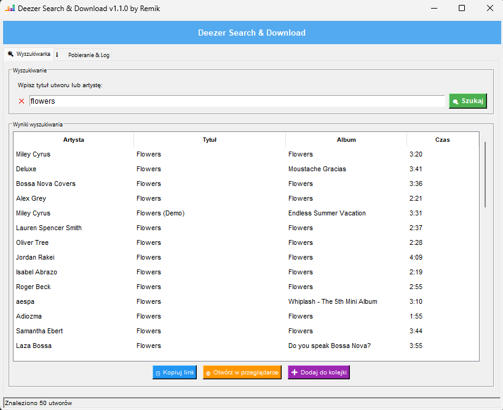
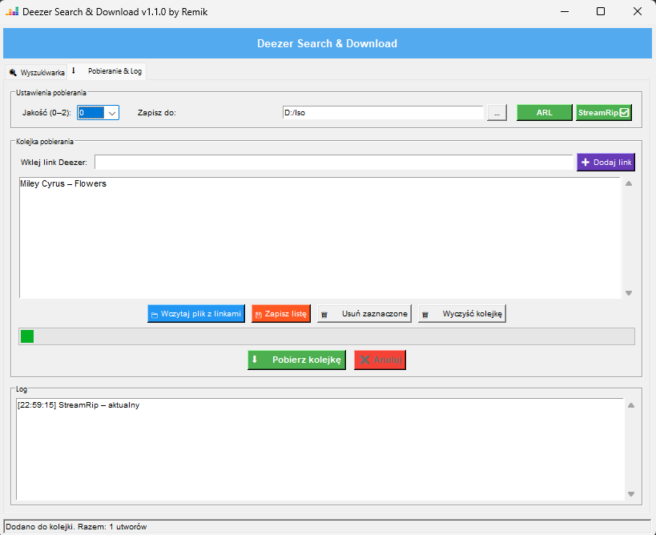

# Deezer Search & Download GUI

Nowoczesny graficzny interfejs (GUI) dla **StreamRip**, napisany w Pythonie z wykorzystaniem **Tkinter**.

Program umożliwia wyszukiwanie utworów w katalogu Deezer, tworzenie kolejki pobierania oraz zarządzanie pobieraniem bez konieczności korzystania z wiersza poleceń.

## Screenshot

<p align="center">
  
</p>

<p align="center">
  
</p>

---

# Główne funkcje

## Wyszukiwanie

- wyszukiwanie utworów przez API Deezer
- prezentacja wyników w czytelnej tabeli
- kopiowanie linku do utworu
- otwieranie utworu w przeglądarce
- dodawanie utworów do kolejki

## Pobieranie

- pobieranie pojedynczych utworów
- pobieranie albumów
- pobieranie playlist
- kolejka pobierania
- zapis i odczyt kolejki z pliku TXT
- możliwość wskazania katalogu docelowego
- anulowanie aktywnego pobierania

## Obsługa StreamRip

- sprawdzanie dostępności aktualizacji StreamRip
- aktualizacja StreamRip z poziomu programu
- automatyczna konfiguracja pliku `config.toml`

## Obsługa ARL

Program potrafi automatycznie:

- odczytać cookie **arl** z profilu Firefox
- wykonać kopię zapasową konfiguracji
- uzupełnić wartość `arl` w pliku `config.toml`
- zapisać odczytaną wartość do pliku `arl.txt`

## Interfejs

- nowoczesny układ zakładek
- skalowanie DPI
- menu kontekstowe Kopiuj/Wklej
- log wykonywanych operacji
- pasek statusu
- pasek postępu pobierania

---

# Wymagania

- Python 3.10 lub nowszy
- StreamRip
- Firefox (do automatycznego odczytu ARL)

---

# Instalacja

## 1. Sklonuj repozytorium

```bash
git clone https://github.com/TWOJE_KONTO/deezer-search-download.git

cd deezer-search-download
```

## 2. Zainstaluj zależności

```bash
pip install streamrip requests pyperclip
```

lub

```bash
pip install -r requirements.txt
```

---

# Uruchomienie

```bash
python deezer.py
```

lub pod Windows

```text
deezer.pyw
```

---

# Zależności

Projekt wykorzystuje:

- streamrip
- requests
- pyperclip
- tkinter (standardowa biblioteka Pythona)
- sqlite3
- pathlib
- threading

---

# Struktura projektu

```
deezer.py              Główna aplikacja GUI
arl_firefox.py         Narzędzie do odczytu ARL z Firefox
deezer.ico             Ikona programu
README.md
requirements.txt
```

---

# Obsługiwane systemy

- Windows
- Linux
- macOS (częściowo) /nigdy nie testowany/

---

# Jak działa

1. Wyszukaj utwór.
2. Dodaj go do kolejki.
3. Wybierz katalog zapisu.
4. Kliknij **Pobierz kolejkę**.
5. Program uruchamia StreamRip w tle i prezentuje postęp.

---

# Licencja

Kod źródłowy udostępniony na licencji MIT.

Pamiętaj, że korzystanie z usług Deezer oraz pobieranie treści podlega warunkom korzystania z serwisu Deezer. Użytkownik jest odpowiedzialny za przestrzeganie obowiązujących przepisów i warunków licencyjnych.

---

# Autor

Remik

Projekt napisany w Pythonie z wykorzystaniem Tkinter oraz StreamRip.